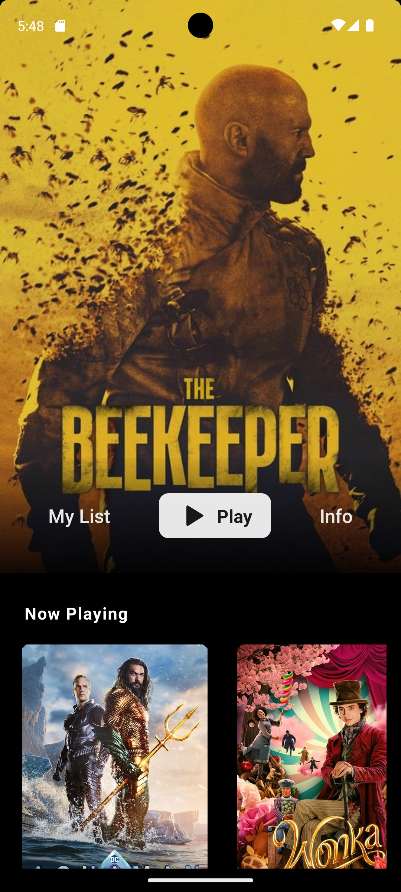
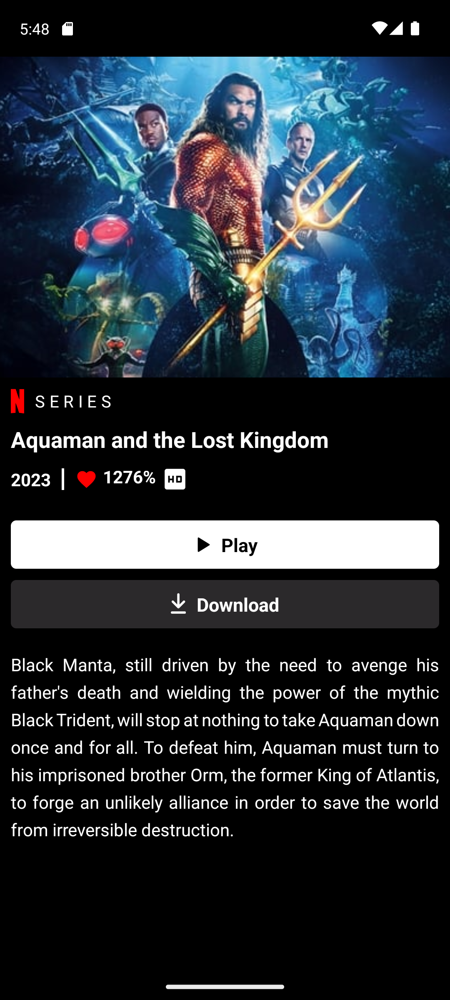

# Netflix Clone - React Native

Welcome to the Netflix Clone App built with React Native! Experience the world of entertainment on your mobile device. Browse and watch your favorite shows and movies seamlessly with a user-friendly interface.

## Table of Contents

- [Introduction](#introduction)
- [Features](#features)
- [Installation](#installation)
- [Usage](#usage)
- [Technologies Used](#technologies-used)
- [Contributing](#contributing)

## Introduction

The Netflix Clone App is a React Native application designed to provide users with an immersive streaming experience. With features like video playback, navigation, and a sleek design, users can enjoy their favorite content on the go.

                        

## Features

- **Streaming Content:** Watch a wide variety of shows and movies in high quality.
- **User Authentication:** Log in and access personalized content.
- **React Navigation:** Seamless navigation between different sections of the app.
- **Video Playback:** Enjoy smooth video playback within the app.

## Installation

1. Clone the repository.
   ```bash
   git clone https://github.com/your-username/password-generator-react-native.git
   ```
2. Install dependencies using your preferred package manager.
   ```bash
   npm install
   ```
3. Run the app:

   ```bash
   npm start

   ```

## Usage

1. Run the app: npm start
2. Open the app on your device using the Expo Go app or an emulator.

## Technologies Used

- React Native CLI
- **Dependencies Used :-**
- Axios
  ,React Navigation
  ,react-native-linear-gradient
  , react-native-orientation-locker
  , react-native-responsive-dimensions
  , react-native-safe-area-context
  , react-native-screens
  , react-native-vector-icons
  , react-native-video

## Contributing

Contributions are welcome! Feel free to open an issue or submit a pull request.
